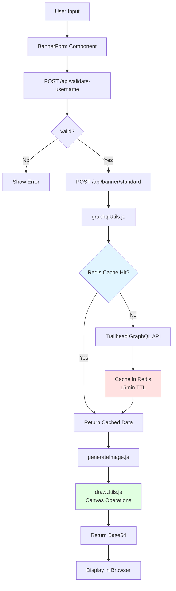

# Agent Context - Trailhead Banner

## Quick Start

**IMPORTANT: This project uses `pnpm`, NOT `npm` or `yarn`.**

```bash
pnpm install # Install dependencies
pnpm dev     # Start dev server (uses turbopack)
pnpm build   # Production build
```

## Tech Stack

- **Framework**: Next.js 16 (App Router + Pages API hybrid)
- **React**: v19
- **Styling**: Tailwind CSS v4
- **Canvas**: @napi-rs/canvas (for image generation)
- **Deployment**: Vercel
- **Caching**: Upstash Redis (15min TTL for GraphQL)
- **Asset Cache**: Vercel Blob (certification logo images cached server-side)
- **Analytics DB**: Supabase (tracks banner/rewind generations and errors)

## Project Purpose

Generates LinkedIn banner images from Trailhead user data (badges, certifications, rank, MVP status).

## Critical Files (Read These First)

| File                                     | Purpose                      |
| ---------------------------------------- | ---------------------------- |
| `src/banner/renderers/standardBanner.js` | Standard banner renderer     |
| `src/banner/api/shared.js`               | Shared API utilities         |
| `src/utils/graphqlUtils.js`              | Trailhead API integration    |
| `src/pages/api/banner/standard.js`       | Standard banner API endpoint |
| `src/data/banners.json`                  | Background image metadata    |
| `src/components/BannerForm.js`           | Main user interface          |

## Architecture Patterns

### Data Flow



**Key Points:**

- All GraphQL queries cached for 15min to reduce Trailhead API load
- Canvas rendering happens server-side using @napi-rs/canvas
- API responses (`/api/banner/**`) return the generated banner as base64 for direct browser display
- Vercel Blob is used internally as an asset cache for certification logo images (`src/utils/blobUtils.js`, `src/utils/cacheUtils.js`); it is not used to store or share generated banners

### GraphQL Queries

- All queries in `src/graphql/queries/`
- Cached via `redisCacheUtils.js`
- Error handling in `graphqlUtils.js`

### Image Generation

1. Fetch user data from Trailhead API
2. Validate with `usernameValidation.js` and `imageValidation.js`
3. Draw on canvas using `drawUtils.js`
4. Return base64 and display in browser

### Directory Structure

```text
src/
├── app/              # Next.js App Router pages
├── pages/api/        # API routes (Pages Router)
├── components/       # React components
├── utils/            # Business logic & helpers
├── graphql/queries/  # GraphQL query definitions
└── data/             # Static data (banners.json)
```

## Code Style & Conventions

- **Formatting**: Prettier + Stylelint (enforced by husky pre-commit)
- **Commits**: Conventional commits `type(scope): description`
  - Common types: `feat, fix, docs, style, refactor, perf, build, chore`
  - Common scopes: `core, deps, ui, config, util, release`
- **Format Code**: Run `bash scripts/agent/format.sh` to check or `bash scripts/agent/format-fix.sh` to auto-fix

## Common Tasks

### Create or Edit a Page

When creating a new page or editing an existing one, always add or update the `export const metadata` block at the top of the `page.js` file. Every page must have:

- `title` — unique, descriptive, under 60 characters
- `description` — unique, 1–2 sentences summarising the page content
- `alternates.canonical` — absolute URL of the page
- `openGraph` — title, description, url, siteName (`'Trailhead Banner'`), type (`'website'`), images (always include `{ url: '/og-image.png', width: 1200, height: 630, alt: '...' }`)
- `twitter` — card (`'summary_large_image'`), title, description, images (`['/og-image.png']`)

**OG images:** most pages use `/og-image.png` (default, 1200×630px). Exceptions:

- `/rewind` uses `/og-image-rewind.png` — distinct seasonal identity

> **Important:** page-level `openGraph` replaces (not merges) the layout default — always repeat the `images` array or the OG image will be lost.

See any existing page (e.g. `src/app/examples/page.js`) as a reference.

When **adding** a new page, also update:

1. `src/app/sitemap.js` — add an entry with appropriate `priority` and `changeFrequency`
2. `public/llms.txt` — add a line under `## Pages` with the URL and a one-line description
3. `public/llms-full.txt` — add the page under `## Pages` and update any relevant sections (API, features, etc.)

When **removing** a page, remove it from both files as well.

### Add New Background Image

1. Add to `public/assets/background-library/`
2. Update `src/data/banners.json` with metadata
3. Verify in background library page

### Modify Banner Layout

- Edit `src/utils/drawUtils.js` for positioning
- Edit `src/utils/generateImage.js` for overall logic

### Update Trailhead Data Fetching

- Queries: `src/graphql/queries/`
- Processing: `src/utils/dataUtils.js`
- Caching: `src/utils/redisCacheUtils.js` (15min TTL)

## Key External Dependencies

- **Trailhead GraphQL API**: Source of user data (cached)
- **@napi-rs/canvas**: Server-side canvas rendering
- **Upstash Redis**: Query result caching
- **Vercel Blob**: Server-side asset cache for certification logo images (not used for generated banners)
- **Supabase**: Analytics database — tracks every banner/rewind generation (`banners`, `rewinds` tables) and errors (`errors` table); implemented in `src/utils/supabaseUtils.js`, requires `NEXT_PUBLIC_SUPABASE_URL` and `NEXT_PUBLIC_SUPABASE_ANON_KEY` env vars

## Debugging Quick Tips

- **Canvas errors**: Check `@napi-rs/canvas` compatibility
- **GraphQL failures**: Check cache TTL and Trailhead API status
- **Validation errors**: See `src/utils/usernameValidation.js` rules
- **Build errors**: Ensure using `pnpm`, not `npm`

## Agent Skills and Workflows

Reusable skills and their direct commands:

- **`format`** — `bash scripts/agent/format.sh`; check formatting without modifying files
- **`format-fix`** — `bash scripts/agent/format-fix.sh`; run Prettier and Stylelint fixes
- **`build`** — `bash scripts/agent/build.sh`; validate the production build
- **`dev-start`** — `bash scripts/agent/dev-start.sh`; start the dev server in the background
- **`dev-stop`** — `bash scripts/agent/dev-stop.sh`; stop the background dev server
- **`img-test [username]`** — `bash scripts/agent/img-test.sh [username]`; test image generation
- **`verify [username...]`** — `bash scripts/agent/verify.sh [username...]`; run the full verification workflow

## Verifying Changes

Before committing non-trivial changes, run `bash scripts/agent/verify.sh`. It stops any running dev server (a production build breaks it), runs `pnpm build`, starts a fresh dev server, generates a banner via `POST /api/banner/standard` for each username, stops the server, and prints `Verify: PASS` or `FAIL`. For a quick iteration loop, use `bash scripts/agent/dev-start.sh` followed by `bash scripts/agent/img-test.sh`.

## Token-Saving References

Instead of asking for details, read these directly:

- Username validation rules → `src/utils/usernameValidation.js`
- Image validation logic → `src/utils/imageValidation.js`
- API endpoint patterns → `src/pages/api/*.js`
- Component structure → `src/components/BannerForm.js`
- Background configs → `src/data/banners.json`

## Working Docs

The `docs/` folder contains two kinds of documents:

- **Feature notes** — plans, open questions, and migration steps for features currently in progress
- **Reference guides** — e.g. `docs/banner-components.md`, the full guide for banner components

Before starting work on an ongoing feature, look in `docs/` for an existing note about it.

---

## Banner Component Architecture

Banner code lives in `src/banner/`: `components/` holds reusable parts (background, rankLogo, counters, certifications, superbadges, agentblazer, mvpRibbon, watermark), `renderers/` holds banner implementations (standardBanner.js).

Every component exports 4 functions: `prepare*` (async — load assets, compute layout), `render*` (draw to canvas), `get*Warnings`, `get*Timings`. Renderers follow 3 phases: **prepare** (components in parallel via `Promise.all`) → **render** (sequential, for correct layering) → **collect** warnings and encode to base64.

> **Before writing banner code, read `docs/banner-components.md`** — full templates for new banner types and components, canvas best practices, and layout patterns.

### Common Pitfalls

1. **Always use default parameters**: `options = {}` prevents undefined errors
2. **Null-safe access**: `prepared?.width ?? 0` when reading dimensions
3. **Validate URLs**: Block private IPs, check protocols (SSRF protection)
4. **Check edge cases**: Division by zero when only 1 item exists
5. **Visual semantics**: expired certifications → grayscale; retired → 50% opacity
6. **Canvas**: ES6 modules throughout; canvas objects draw directly via `drawImage`; use CSS filters (`ctx.filter`), not `putImageData`
