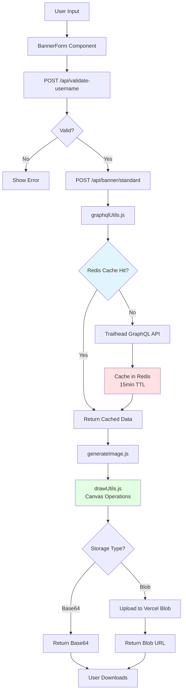

# Claude Code Context - Trailhead-Banner

## Quick Start

**IMPORTANT: This project uses `pnpm`, NOT `npm` or `yarn`.**

```bash
pnpm install # Install dependencies
pnpm dev     # Start dev server (uses turbopack)
pnpm build   # Production build
```

## Tech Stack

- **Framework**: Next.js 16 (App Router + Pages API hybrid)
- **React**: v19
- **Styling**: Tailwind CSS v4
- **Canvas**: @napi-rs/canvas (for image generation)
- **Deployment**: Vercel
- **Caching**: Upstash Redis (15min TTL for GraphQL)
- **Storage**: Vercel Blob (for generated images)

## Project Purpose

Generates LinkedIn banner images from Trailhead user data (badges, certifications, rank, MVP status).

## Critical Files (Read These First)

| File                                     | Purpose                      |
| ---------------------------------------- | ---------------------------- |
| `src/banner/renderers/standardBanner.js` | Standard banner renderer     |
| `src/banner/api/shared.js`               | Shared API utilities         |
| `src/utils/graphqlUtils.js`              | Trailhead API integration    |
| `src/pages/api/banner/standard.js`       | Standard banner API endpoint |
| `src/data/banners.json`                  | Background image metadata    |
| `src/components/BannerForm.js`           | Main user interface          |

## Architecture Patterns

### Data Flow



**Key Points:**

- All GraphQL queries cached for 15min to reduce Trailhead API load
- Canvas rendering happens server-side using @napi-rs/canvas
- Images can be returned as base64 or uploaded to Vercel Blob for sharing

### GraphQL Queries

- All queries in `src/graphql/queries/`
- Cached via `redisCacheUtils.js`
- Error handling in `graphqlUtils.js`

### Image Generation

1. Fetch user data from Trailhead API
2. Validate with `usernameValidation.js` and `imageValidation.js`
3. Draw on canvas using `drawUtils.js`
4. Return base64 or upload to Vercel Blob

### Directory Structure

```text
src/
├── app/              # Next.js App Router pages
├── pages/api/        # API routes (Pages Router)
├── components/       # React components
├── utils/            # Business logic & helpers
├── graphql/queries/  # GraphQL query definitions
└── data/             # Static data (banners.json)
```

## Code Style & Conventions

- **Formatting**: Prettier + Stylelint (enforced by husky pre-commit)
- **Commits**: Conventional commits `type(scope): description`
  - Common types: `feat, fix, docs, style, refactor, perf, build, chore`
  - Common scopes: `core, deps, ui, config, util, release`
- **Format Code**: Use `/format` to check or `/format-fix` to auto-fix (token-optimized)

## Common Tasks

### Add New Background Image

1. Add to `public/assets/background-library/`
2. Update `src/data/banners.json` with metadata
3. Verify in background library page

### Modify Banner Layout

- Edit `src/utils/drawUtils.js` for positioning
- Edit `src/utils/generateImage.js` for overall logic

### Update Trailhead Data Fetching

- Queries: `src/graphql/queries/`
- Processing: `src/utils/dataUtils.js`
- Caching: `src/utils/redisCacheUtils.js` (15min TTL)

## Key External Dependencies

- **Trailhead GraphQL API**: Source of user data (cached)
- **@napi-rs/canvas**: Server-side canvas rendering
- **Upstash Redis**: Query result caching
- **Vercel Blob**: Generated image storage

## Debugging Quick Tips

- **Canvas errors**: Check `@napi-rs/canvas` compatibility
- **GraphQL failures**: Check cache TTL and Trailhead API status
- **Validation errors**: See `src/utils/usernameValidation.js` rules
- **Build errors**: Ensure using `pnpm`, not `npm`

## Claude Code Skills

Token-optimized commands available:

- **`/format`** - Check formatting (non-destructive, shows OK/ISSUES + top 3 errors)
- **`/format-fix`** - Auto-fix formatting issues (runs prettier + stylelint fix)
- **`/build`** - Validate build (shows OK or top 5 errors with duration)
- **`/dev-start`** - Start dev server in background (zero output, waits until ready)
- **`/dev-stop`** - Stop background dev server (cleanup)
- **`/img-test [username]`** - Test image generation API (requires dev server, default: nabondance)

## Token-Saving References

Instead of asking for details, read these directly:

- Username validation rules → `src/utils/usernameValidation.js`
- Image validation logic → `src/utils/imageValidation.js`
- API endpoint patterns → `src/pages/api/*.js`
- Component structure → `src/components/BannerForm.js`
- Background configs → `src/data/banners.json`

---

## Banner Component Architecture

### Banner Directory Structure

```text
src/banner/
├── components/        # Reusable components (background, logos, certifications)
│   ├── background.js
│   ├── rankLogo.js
│   ├── counters.js
│   ├── certifications.js
│   ├── superbadges.js
│   ├── agentblazer.js
│   ├── mvpRibbon.js
│   └── watermark.js
└── renderers/         # Banner implementations (standard, rewind, future types)
    └── standardBanner.js
```

### Component Contract

All components follow this 4-function pattern:

```javascript
// 1. PREPARE - Load assets, calculate layout (async, runs in parallel)
async function prepare*(data, options = {}, layout) {
  // Load images, process data, calculate positions
  return { /* prepared data, warnings, timings */ };
}

// 2. RENDER - Draw to canvas (sequential for correct layering)
async function render*(ctx, prepared, x, y) {
  ctx.drawImage(...);  // Draw using prepared data
  return { render_ms: timeElapsed };
}

// 3. WARNINGS - Get any issues encountered
function get*Warnings(prepared) {
  return prepared?.warnings || [];
}

// 4. TIMINGS - Get performance metrics
function get*Timings(prepared) {
  return prepared?.timings || {};
}

export { prepare*, render*, get*Warnings, get*Timings };
```

### Creating a New Banner Type

Create `src/banner/renderers/myBanner.js` following the 3-phase pattern:

```javascript
import { createCanvas } from '@napi-rs/canvas';
import * as Background from '../components/background.js';
import * as Certifications from '../components/certifications.js';

const CANVAS_WIDTH = 1584;
const CANVAS_HEIGHT = 396;

async function generateMyBanner(data, options = {}) {
  const canvas = createCanvas(CANVAS_WIDTH, CANVAS_HEIGHT);
  const ctx = canvas.getContext('2d');

  // PHASE 1: PREPARE (parallel when possible)
  const [bgPrep, certsPrep] = await Promise.all([
    Background.prepareBackground(options),
    Certifications.prepareCertifications(data.certificationsData, options, {
      availableWidth: CANVAS_WIDTH,
      availableHeight: CANVAS_HEIGHT * 0.75,
      spacing: 5,
    }),
  ]);

  // PHASE 2: RENDER (sequential for correct layering)
  await Background.renderBackground(ctx, bgPrep, CANVAS_WIDTH, CANVAS_HEIGHT);
  await Certifications.renderCertifications(ctx, certsPrep, 0, 100);

  // PHASE 3: COLLECT warnings and encode
  const warnings = [
    ...Background.getBackgroundWarnings(bgPrep),
    ...Certifications.getCertificationsWarnings(certsPrep),
  ];

  return {
    bannerUrl: `data:image/png;base64,${canvas.toBuffer('image/png').toString('base64')}`,
    warnings,
  };
}
```

### Creating a New Component

Create `src/banner/components/myComponent.js`:

```javascript
import { createCanvas, loadImage } from '@napi-rs/canvas';

async function prepareMyComponent(data, options = {}, layout) {
  const startTime = Date.now();
  const warnings = [];

  // Load assets, process data, calculate layout
  // ...

  return {
    // Your data for rendering
    warnings,
    timings: { load_ms: Date.now() - startTime },
  };
}

async function renderMyComponent(ctx, prepared, x, y) {
  const startTime = Date.now();

  // Use ctx.drawImage(), ctx.fillRect(), etc. to draw
  // ...

  return { render_ms: Date.now() - startTime };
}

function getMyComponentWarnings(prepared) {
  return prepared?.warnings || [];
}

function getMyComponentTimings(prepared) {
  return prepared?.timings || {};
}

export { prepareMyComponent, renderMyComponent, getMyComponentWarnings, getMyComponentTimings };
```

### Canvas & Drawing Best Practices

**Module System:** Use ES6 modules (`import`/`export`) throughout

**Canvas objects work as images** - No conversion needed:

```javascript
const canvas = createCanvas(width, height);
ctx.drawImage(canvas, x, y); // ✅ Works directly
```

**Use CSS filters for effects**:

```javascript
// ✅ Correct - CSS filter
const grayCtx = canvas.getContext('2d');
grayCtx.filter = 'grayscale(100%)';
grayCtx.drawImage(sourceImage, 0, 0);

// ❌ Avoid - putImageData doesn't persist properly
ctx.putImageData(modifiedImageData, x, y);
```

**Visual effects semantics**:

- Expired certifications → Grayscale (action required)
- Retired certifications → 50% opacity (not user's fault)

### Layout Patterns

**Fixed positions** for predictable elements:

```javascript
const counterX = 160;
const agentblazerX = 370;
```

**Ratio-based positions** for responsive areas:

```javascript
const bottomAreaY = CANVAS_HEIGHT * TOP_PART_RATIO + 20;
```

**Layout constraints** passed to components:

```javascript
const layout = {
  availableWidth: CANVAS_WIDTH,
  availableHeight: CANVAS_HEIGHT * 0.75,
  spacing: 5,
};
```

### Common Pitfalls

1. **Always use default parameters**: `options = {}` prevents undefined errors
2. **Null-safe access**: `prepared?.width ?? 0` when reading dimensions
3. **Validate URLs**: Block private IPs, check protocols (SSRF protection)
4. **Check edge cases**: Division by zero when only 1 item exists
5. **Module system**: Use ES6 (`import`/`export`) throughout
