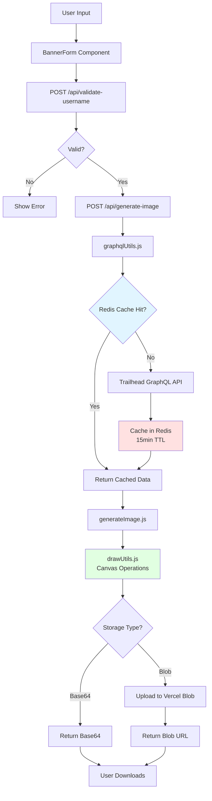

# Claude Code Context - Trailhead-Banner

## Quick Start

**IMPORTANT: This project uses `pnpm`, NOT `npm` or `yarn`.**

```bash
pnpm install # Install dependencies
pnpm dev     # Start dev server (uses turbopack)
pnpm build   # Production build
```

## Tech Stack

- **Framework**: Next.js 16 (App Router + Pages API hybrid)
- **React**: v19
- **Styling**: Tailwind CSS v4
- **Canvas**: @napi-rs/canvas (for image generation)
- **Deployment**: Vercel
- **Caching**: Upstash Redis (15min TTL for GraphQL)
- **Storage**: Vercel Blob (for generated images)

## Project Purpose

Generates LinkedIn banner images from Trailhead user data (badges, certifications, rank, MVP status).

## Critical Files (Read These First)

| File                              | Purpose                     |
| --------------------------------- | --------------------------- |
| `src/utils/generateImage.js`      | Core image generation logic |
| `src/utils/drawUtils.js`          | Canvas drawing operations   |
| `src/utils/graphqlUtils.js`       | Trailhead API integration   |
| `src/pages/api/generate-image.js` | Main API endpoint           |
| `src/data/banners.json`           | Background image metadata   |
| `src/components/BannerForm.js`    | Main user interface         |

## Architecture Patterns

### Data Flow



**Key Points:**

- All GraphQL queries cached for 15min to reduce Trailhead API load
- Canvas rendering happens server-side using @napi-rs/canvas
- Images can be returned as base64 or uploaded to Vercel Blob for sharing

### GraphQL Queries

- All queries in `src/graphql/queries/`
- Cached via `redisCacheUtils.js`
- Error handling in `graphqlUtils.js`

### Image Generation

1. Fetch user data from Trailhead API
2. Validate with `usernameValidation.js` and `imageValidation.js`
3. Draw on canvas using `drawUtils.js`
4. Return base64 or upload to Vercel Blob

### Directory Structure

```text
src/
├── app/              # Next.js App Router pages
├── pages/api/        # API routes (Pages Router)
├── components/       # React components
├── utils/            # Business logic & helpers
├── graphql/queries/  # GraphQL query definitions
└── data/             # Static data (banners.json)
```

## Code Style & Conventions

- **Formatting**: Prettier + Stylelint (enforced by husky pre-commit)
- **Commits**: Conventional commits `type(scope): description`
  - Common types: `feat, fix, docs, style, refactor, perf, build, chore`
  - Common scopes: `core, deps, ui, config, util, release`
- **Format Code**: Use `/format` to check or `/format-fix` to auto-fix (token-optimized)

## Common Tasks

### Add New Background Image

1. Add to `public/assets/background-library/`
2. Update `src/data/banners.json` with metadata
3. Verify in background library page

### Modify Banner Layout

- Edit `src/utils/drawUtils.js` for positioning
- Edit `src/utils/generateImage.js` for overall logic

### Update Trailhead Data Fetching

- Queries: `src/graphql/queries/`
- Processing: `src/utils/dataUtils.js`
- Caching: `src/utils/redisCacheUtils.js` (15min TTL)

## Key External Dependencies

- **Trailhead GraphQL API**: Source of user data (cached)
- **@napi-rs/canvas**: Server-side canvas rendering
- **Upstash Redis**: Query result caching
- **Vercel Blob**: Generated image storage

## Debugging Quick Tips

- **Canvas errors**: Check `@napi-rs/canvas` compatibility
- **GraphQL failures**: Check cache TTL and Trailhead API status
- **Validation errors**: See `src/utils/usernameValidation.js` rules
- **Build errors**: Ensure using `pnpm`, not `npm`

## Claude Code Skills

Token-optimized commands available:

- **`/format`** - Check formatting (non-destructive, shows OK/ISSUES + top 3 errors)
- **`/format-fix`** - Auto-fix formatting issues (runs prettier + stylelint fix)
- **`/build`** - Validate build (shows OK or top 5 errors with duration)
- **`/dev-start`** - Start dev server in background (zero output, waits until ready)
- **`/dev-stop`** - Stop background dev server (cleanup)
- **`/img-test [username]`** - Test image generation API (requires dev server, default: nabondance)

## Token-Saving References

Instead of asking for details, read these directly:

- Username validation rules → `src/utils/usernameValidation.js`
- Image validation logic → `src/utils/imageValidation.js`
- API endpoint patterns → `src/pages/api/*.js`
- Component structure → `src/components/BannerForm.js`
- Background configs → `src/data/banners.json`
